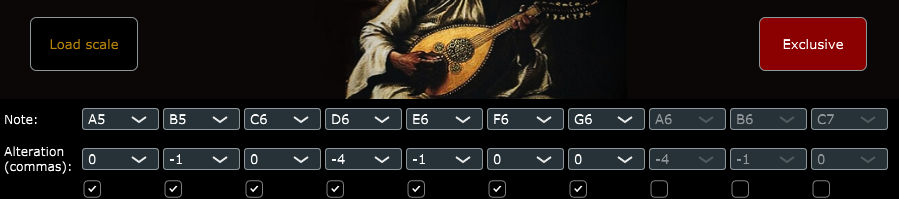
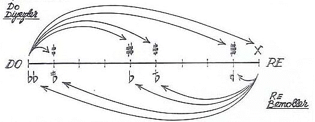

# MakaMIDI  
Adjust MIDI pitch according to Turkish Makam scales (monophonic, single MIDI channel)

---

## Overview

MakaMIDI is a MIDI VST3 plugin designed to alter the pitch of incoming MIDI notes according to Turkish Makam microtonal scales. The plugin works monophonically on a single MIDI channel, providing precise pitch alterations with support for custom scales.

---

## How to Use

1. Insert the plugin on a MIDI track or MIDI effect slot in your DAW.  
2. Enable/Disable the alteration options via the toggle buttons in the GUI.  
3. Select the target notes and the corresponding pitch alteration in commas (microtonal units).  
4. Once set, the plugin will alter the pitch of incoming MIDI notes accordingly.

---

## Turkish Makam Model and Commas

  
    

This model divides a whole tone into 9 equal commas to handle microtonal pitch variations, based on the Turkish Makam system.  
For more details, see [Turkish makam - Wikipedia](https://en.wikipedia.org/wiki/Turkish_makam).

---

## Loading Scales

You can load custom pitch alteration presets from CSV files (e.g., `Rast.csv` and `Saba.csv` included). Loading a new CSV will overwrite the current alterations.

- If more than 16 alterations exist, only the first 10 will appear in the ComboBoxes, but all will be active.  
- Alteration value `0` means the note is present unaltered in the scale.  
- Alteration value `NaN` means the note is excluded (see **Exclusive Mode**).

---

## Exclusive Mode

Activate **Exclusive Mode** by pressing the red toggle button in the upper-right corner of the GUI.

- When enabled, all notes **not specified** in the alterations will be muted.  
- To play an unaltered note in this mode, set its alteration value to `0`.

---

## Installation

- Copy the `.vst3` plugin folder into your system’s VST3 directory (e.g., `C:\VstPlugins` on Windows).  
- Rescan plugins in your DAW.  
- Load the plugin on a MIDI track before your MIDI synthesizer.

---

## Notes

- The plugin is released as **VST3 only**.  
- The pitch wheel range of your MIDI synth should be set to **1 tone** for accurate pitch bending corresponding to the Turkish Makam system.  
- Currently, the plugin supports **monophonic** MIDI processing only (one note at a time), suppressing previous notes when a new one is played.

---

### Author

Mattia Vassena

[Website](https://sites.google.com/view/mattiavassena-en/home)

[GitHub @mtia](https://github.com/mtia)  

📧 mattia_vassena@yahoo.com

### References

- Murat Aydemir, *Turkish Music Makam Guide*. Pan Yayıncılık, Istanbul, 2010.  
  A comprehensive reference on the theory and practice of Turkish makam music, including historical context and pitch systems.
- [Turkish makam - Wikipedia](https://en.wikipedia.org/wiki/Turkish_makam)

### Feedback and Contributions

Please report bugs or request features by opening an issue on the GitHub repository. Contributions are welcome!

### License

This project is licensed under the MIT License.  
See the [LICENSE](LICENSE) file for full details.
