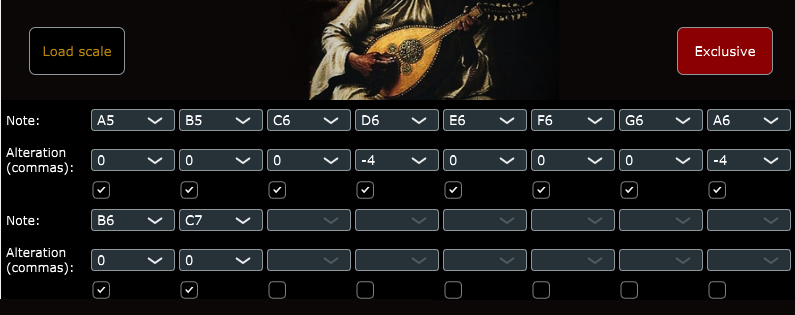

# MakaMIDI
Adjust MIDI message pitch according to makam scales (Monophonic single-channel use)

## Instructions

Insert the plugin into a MIDI track of a DAW. Activate the alterations menù through the toggle buttons and select the note and the alteration in commas. Once the menus are set and active, the plugin should be already altering the pitch of the incoming notes.

### Turkish makam model and commas

  

### Load scale

Load a preset of alterations from a csv file. See sample files Rast.csv and Saba.csv from this folder. The new alterations will overwrite the previously selected ones.
If more than 10 alterations are present, they won't be shown in the ComboBoxes but they will be effective.
Alteration = 0     --> note present in the scale unaltered
Alteration = NaN   --> note not in scale (see Exclusive mode)

### Exclusive mode

By pressing the button in the upper-right corner you'll enter the "Exclusive mode". The button turns red indicating the mode is active.
This mode will mute every note not specified in the alterations. To play an unaltered note, specify zero as alteration.
